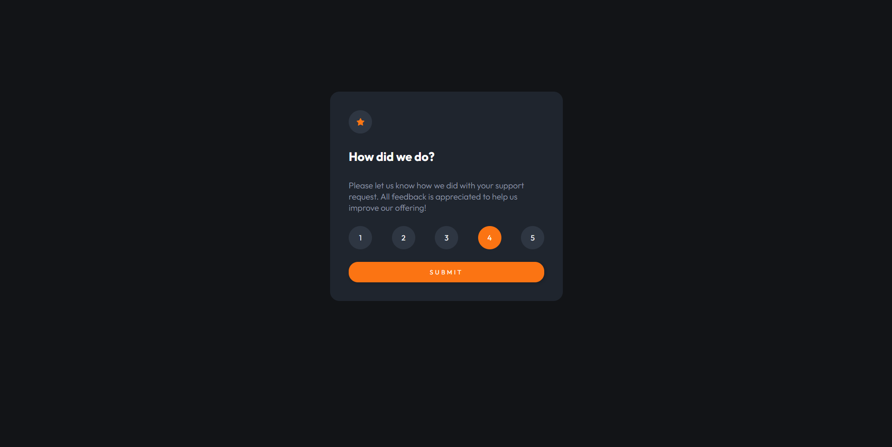

# Frontend Mentor - Interactive rating component

## Table of contents

- [Overview](#overview)
  - [The challenge](#the-challenge)
  - [Screenshot](#screenshot)
  - [Links](#links)
- [My process](#my-process)
  - [Built with](#built-with)
- [Author](#author)

## Overview

### The challenge

Users should be able to:

- View the optimal layout for the app depending on their device's screen size
- See hover states for all interactive elements on the page
- Select and submit a number rating
- See the "Thank you" card state after submitting a rating
### Screenshot

### Links

- Solution URL: (https://github.com/Benjahzz/interactive-rating)
- Live Site URL: (https://benjahzz.github.io/interactive-rating/)

## My process

### Built with

- Semantic HTML5 markup
- CSS custom properties
- Flexbox
- CSS Grid
- Mobile-first workflow
- SCSS
- VueJS

## Author

- Frontend Mentor - [@Benjahzz](https://www.frontendmentor.io/profile/Benjahzz)
- Github - [@Benjahzz](https://github.com/Benjahzz)

